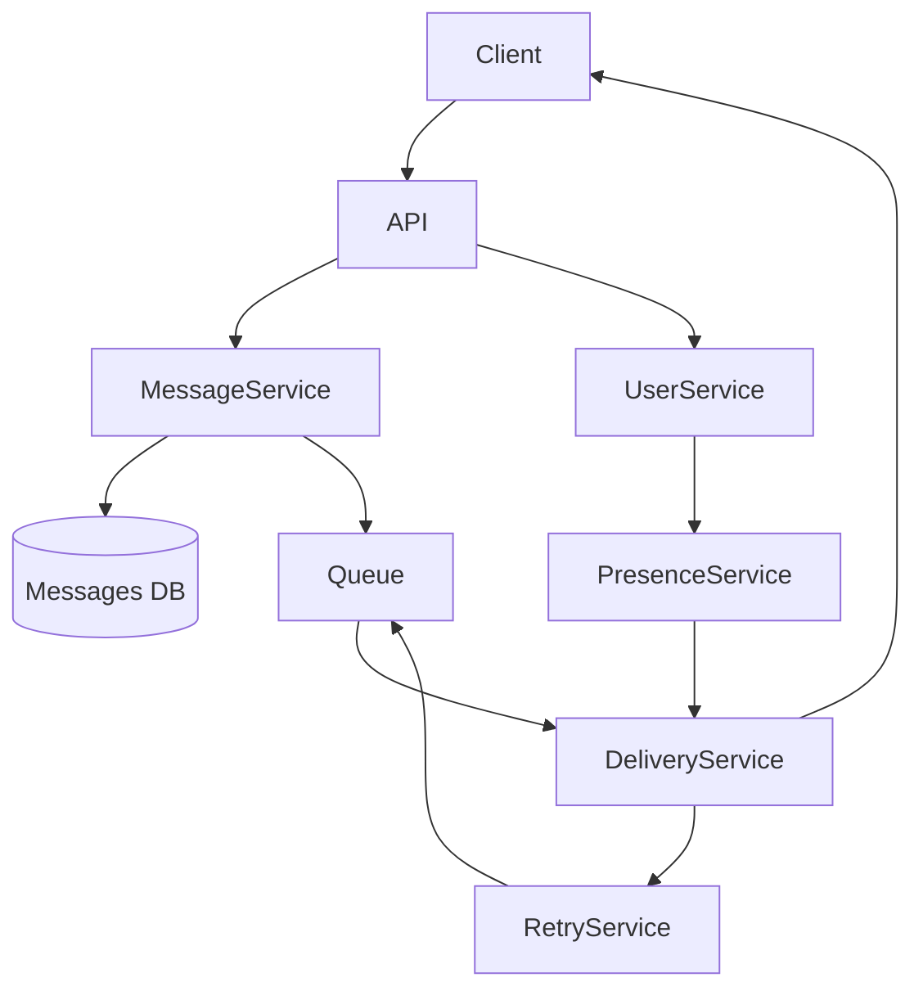
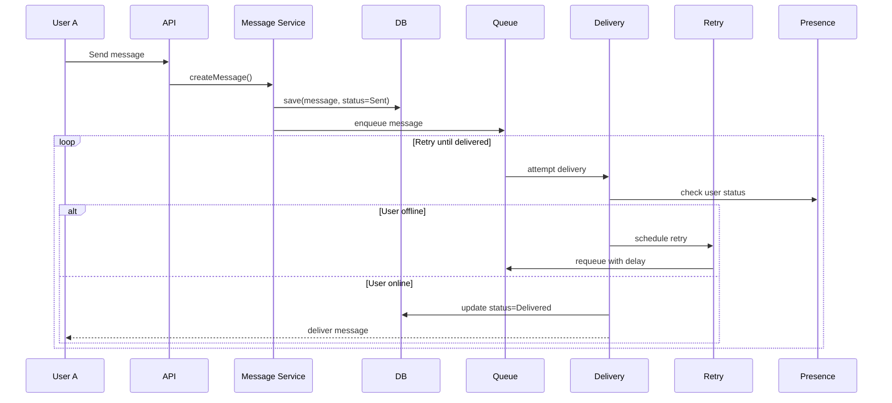
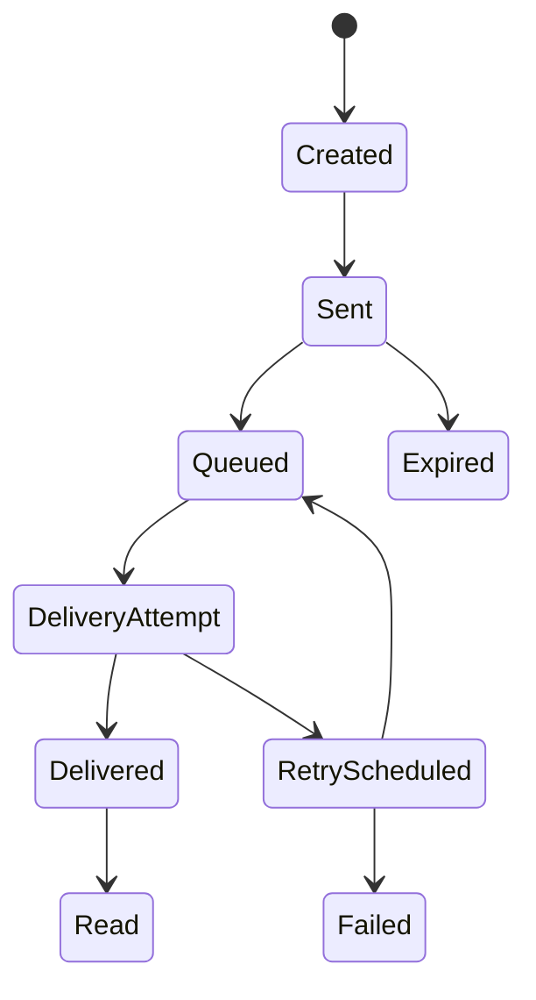

# 🧪 Laboratory Work 1
## Designing a Messaging System — Variant 3 (Offline Message Delivery)

### 🎯 Goal
Learn how to:
- design software systems before coding;
- reason about architecture and responsibilities;
- use Component, Sequence, and State diagrams;
- document decisions using RFC and ADR.

---

## 🧠 Context

You are designing a **messenger system with asynchronous delivery** that supports:
- sending messages between users;
- reliable delivery even if users are offline for long periods;
- message statuses (sent / delivered / read).

❗ No code is required. You act as a **system designer / tech lead**.

---

## 🧩 Functional Requirements

1. A user can send a message to another user.
2. Messages must be stored reliably.
3. The system must:
   - deliver messages asynchronously,
   - retry delivery if the user is offline,
   - update message status.
4. Users may remain offline for a long time.
5. Messages must not be lost.

---

## 🧱 Part 1 — Component Diagram (30%)

### Task
Create a **Component Diagram** that shows:
- system components,
- their responsibilities,
- interactions between them.

### Required components
- Client (Web / Mobile)
- Backend API
- Message Service
- Database
- Queue (for async delivery)
- Delivery Service
- Retry Service
- Presence Service

### Diagram (Mermaid)

--- 

## 🔁 Part 2 — Sequence Diagram (25%)
###Scenario

User A sends a message to user B who is offline for a long time.

### Task

Describe the interaction sequence in time.

---
## 🔄 Part 3 — State Diagram (20%)
### Object

Message

## Task

Describe the message lifecycle.

---
## 📚 Part 4 — ADR (Architecture Decision Record) (25%)
### Task

Document one architecture decision.

# ADR-001: Use Message Queue for Asynchronous Delivery

## Status
Accepted

## Context
Users can be offline for long periods.
The system must guarantee message delivery without blocking message sending.

## Decision
Use a Message Queue to handle asynchronous delivery and retries.
Avoid polling as the primary delivery mechanism.

## Alternatives
- Direct delivery only (rejected — fails for offline users)
- Client polling (considered — inefficient and high load)

## Consequences
+ Reliable delivery
+ Scalable architecture
+ Supports retry mechanisms
- Increased system complexity
- Eventual consistency (delays possible)

## 🔑 Key Design Decisions
- Use Queue instead of polling
- Implement Retry Strategy (exponential backoff)
- Track user status via Presence Service
- Ensure messages are never lost
